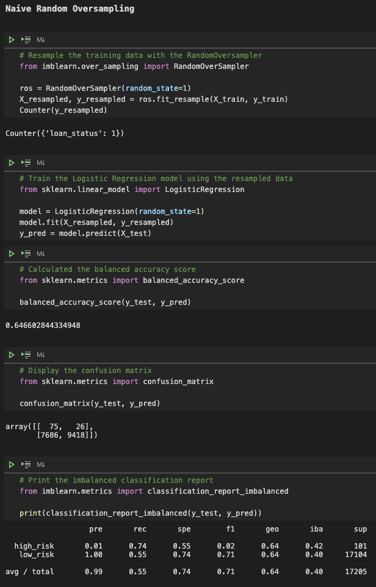
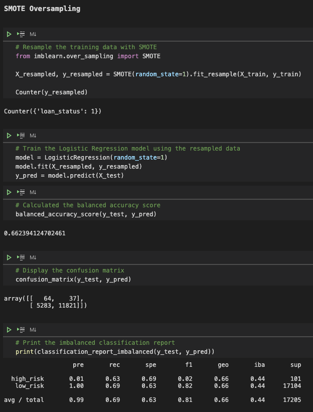
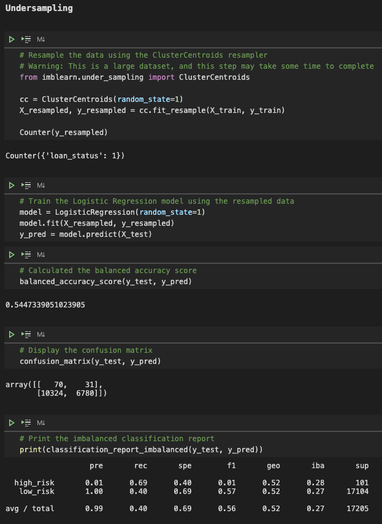
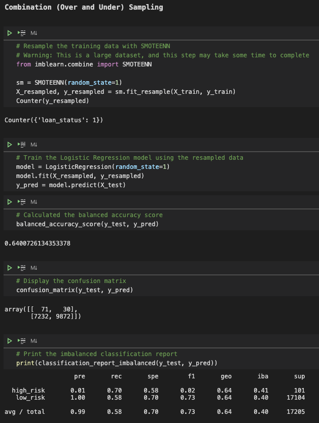
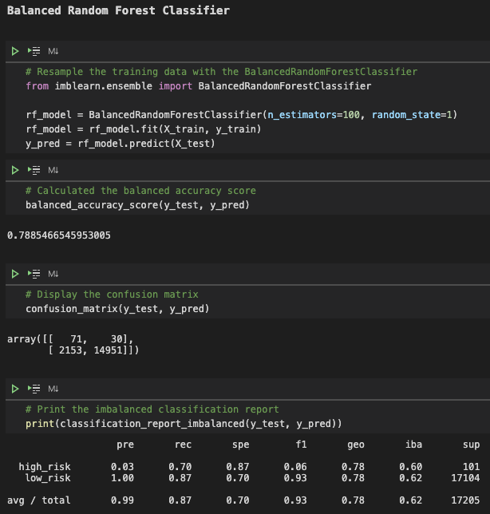

# Credit_Risk_Analysis

## Overview of the Loan Prediction Risk Analysis

People barrow money to purchase homes, cars, start businesses and pursue education.  Loans are an essential part to modern society, but loans can present opportunity and challenges to banks and other lending institutions.  Loans can create revenue, for banks, with the interest they generate but there’s risk that the barrower won’t repay the loan and the banks will lose money.  

The rise of financial technology, or FinTech, has enabled lenders to use machine learning to analysis risk because it can analysis large amounts of data to arrive at a single decision, whether or not to approve a loan application.  For this analysis, I used Python and the Scikit-Learn library to build and evaluate several machine learning models to predict the credit risk.  Being able to predict credit risk with machine learning algorithms can help banks and financial institutions predict anomalies, reduce risk cases, monitor portfolios, and provide recommendations on what to do in cases of fraud.

## Results

-	The Naive Random Oversampling Model had a balanced accuracy score of ~65%.  For the high-risk category, the precision is very low at 1%, and the recall is 74%.  The low-risk category has a precision of 100%, and recall of 55%. The F1 score, which rates performance based on both precision and recall, is 2% for the high-risk category and 74% for the low-risk category.  This is not a suitable machine learning model to predict credit risk.

-	The SMOTE Oversampling Model had a balanced accuracy score of ~66%.  For the high-risk category, the precision is very low at 1%, and the recall is 63%.  The low-risk category has a precision of 100%, and recall of 69%. The F1 score, which rates performance based on both precision and recall, is 2% for the high-risk category and 82% for the low-risk category.  This is not a suitable machine learning model to predict credit risk.

-	The Undersampling Model had a balanced accuracy score of ~54%.  For the high-risk category, the precision is very low at 1%, and the recall is 69%.  The low-risk category has a precision of 100%, and recall of 40%. The F1 score, which rates performance based on both precision and recall, is 1% for the high-risk category and 57% for the low-risk category.  This is not a suitable machine learning model to predict credit risk.

-	The Combination (Over and Under) Sampling Model had a balanced accuracy score of ~64%.  For the high-risk category, the precision is very low at 1%, and the recall is 70%.  The low-risk category has a precision of 100%, and recall of 58%. The F1 score, which rates performance based on both precision and recall, is 2% for the high-risk category and 73% for the low-risk category.  This is not a suitable machine learning model to predict credit risk.

-	The Balanced Random Forest Classifier Model had a balanced accuracy score of ~79%.  For the high-risk category, the precision is low at 3%, and the recall is 70%.  The low-risk category has a precision of 100%, and recall of 87%. The F1 score, which rates performance based on both precision and recall, is 6% for the high-risk category and 93% for the low-risk category.  This is a suitable machine learning model to predict credit risk.

-	The Easy Ensemble AdaBoost Classifier Model had a balanced accuracy score of ~93%.  For the high-risk category, the precision is 9%, and the recall is 92%.  The low-risk category has a precision of 100%, and recall of 94%. The F1 score, which rates performance based on both precision and recall, is 16% for the high-risk category and 97% for the low-risk category.  This is the most suitable machine learning model to predict credit risk.

 Sampling) I used oversampling, Undersampling and combination of both to predict credit risk.  In the last two machine learning models (Balanced Random Forest Classifier and Easy Ensemble AdaBoost Classifier) I resampled the data using ensemble classifiers to predict the credit risk.  The balanced accuracy scores for the first four models were relatively low compared to the last two models.  Also, the F1 score, which rates performance based on both precision and recall, for the first four models were lower compared to the last two models.

In order to create a successful machine learning model, you want to have a balance of recall and precision which is why I recommend the ensemble classifier models over the first four models.  If I had to recommend a machine learning model for a lending institution to use to predict credit risk, it would be the Easy Ensemble AdaBoost Classifier Model because of its high balanced accuracy score and the best balance of precision and recall scores or F1 score.  Although, I would note to the lending institution that the model did not display a high precision score for high-risk category so to use the model with caution and that understanding.